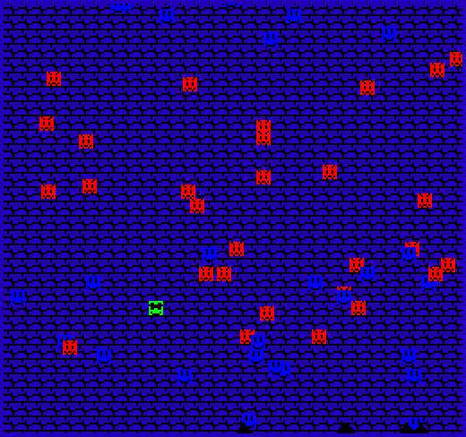

# (TODO: your game's title)

Author: Siheng Li

Design: This is a bullet hell game where there are spikes and monsters.
The player constantly falls and the enemies and friends swap after every jump.

Screen Shot:

How Your Asset Pipeline Works:

Python script to turn pictures into txt of the indicies.
The palette is assumed between the python script and the file reader.

How To Play:
Arrow keys to move and jump. Avoid spikes and red enemies.

Sources: things in game 0 and game 1.

This game was built with [NEST](NEST.md).

